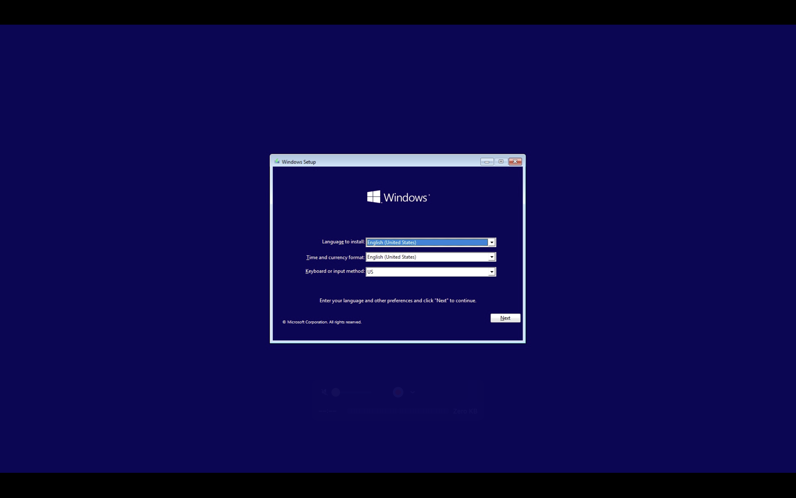

# woa-rk3576

[](https://github.com/gahingwoo/woa-rk3576/actions/workflows/ci.yml)
[](LICENSE)
[]()
[]()

Windows-on-ARM (WOA) kernel drivers for Rockchip **RK3576** boards — Radxa
ROCK 4D, ArmSoM CM5-IO and the other CM5 carriers.

Windows on ARM discovers hardware through **ACPI**, not Device Tree. The boot
firmware and ACPI tables live in the separate EDK2 RK3576 port; **this repo is
the Windows `.sys`/`.inf` driver packages** for the SoC peripherals Windows has
no inbox driver for, plus docs for the peripherals that *do* use inbox drivers.

## Status

| Peripheral | Bind (`_HID`) | Approach | State |
|---|---|---|---|
| [GPIO](drivers/gpio/rk3576gpio) | `RKCP3002` | GpioClx miniport | **Started on hardware** (4 instances) |
| [I²C](drivers/i2c/rk3xi2c) | `RKCP3001` | SpbCx (rk3x) | builds for ARM64² · code 28 on hardware, no driver matched yet |
| [SPI](drivers/spi/rk3xspi) | `RKCP3003`¹ | SpbCx (rk3066) | builds for ARM64² · not run on silicon |
| [SD card](drivers/storage/rkdwmmc) | `RKCPFE2C` | sdport (dw_mmc) | **Started on hardware**, but sdport issues no commands — 3 bus operations and stops ([storage](docs/STORAGE.md)) |
| [eMMC](drivers/storage/rkemmc) | `RKCP0D40` | sdport (DWCMSHC) | **Started on hardware**; identification runs to CMD6 `SWITCH` and the card node appears, `sdstor` then refuses it ([storage](docs/STORAGE.md)) |
| [Ethernet GMAC0](drivers/net/dwmac) | `RKCP6543` | NetAdapterCx (DWMAC-4.20a) | builds for ARM64² · not run on silicon |
| NVMe | — (PCIe) | **inbox** stornvme | **Working** — `stornvme` and `disk` both Started, in a stock ADK WinPE |
| USB (xHCI) | `PNP0D10` | **inbox** usbxhci | working for input; `XHC0` (the USB-C DWC3) is code 10 |
| Display | — (no ACPI) | **inbox** BasicDisplay | UEFI GOP framebuffer ([display](docs/DISPLAY.md)) |
| Audio (SAI + ES8388) | — (no ACPI) | blocked | needs firmware SAI enablement; **USB Audio** works inbox meanwhile ([audio](docs/AUDIO.md)) |

¹ Paired with a small **EDK2/ACPI** change in the RK3576 firmware port (also
  part of this project) — **WIP**, tracked under [firmware changes](#firmware-acpi-changes-wip).
² Zero warnings at `/W4 /WX` against WDK 10.0.26100, checked by CI on every
  push, and the SoC register engines are verified against the mainline kernel
  drivers. Neither has run on hardware — a clean build is not a working driver.

With inbox display (GOP) + USB input + storage + the drivers above, the platform
has every piece needed to boot Windows to the desktop with networking.

### 2026-09-20: where this actually stands

WinPE boots and runs. All 8 CPUs come up at 1608 MHz, the NVMe works on the
inbox driver, and both storage miniports load and start. What does not work
yet is the cards behind them.

**The eMMC is close.** `rkemmc` runs identification cleanly through two full
512-byte EXT_CSD reads with zero data errors, and sdbus creates the card node —
`SD\VID_ab&OID_0022&PID_QK11X`, matching the CID the firmware reads. It dies on
the command after CMD6 `SWITCH`, which is almost certainly a 10 ms wait for an
R1b busy that an eMMC is allowed to hold for hundreds. `sdstor` refuses the
card with `0xC000000D`.

**The SD slot has not moved.** `rkdwmmc` is Started and has issued no commands
at all: three bus operations, then nothing. A different fault from the eMMC's,
and the next one to take apart. The card-detect theory that stood for two days
— an edge-triggered `GpioInt` and a card already in the slot at boot — was
tested by ejecting and reinserting inside WinPE and is **refuted**: nothing
changed.

One firmware-side finding worth knowing before testing anything here: **an SD
card in the slot used to make Windows crawl or bugcheck**, because no UEFI
driver quiesced the SD controller at ExitBootServices and its interrupt line
went to the OS still asserted. Fixed in the firmware port; 4 clean
card-present boots since, which is not yet a number to trust.

### 2026-09-18: Windows Setup boots on CM5-IO



Setup had been bugchecking `ACPI_BIOS_ERROR` on every attempt. The cause was
an ACPI **SCMI** device inherited from RK3588 that drives a doorbell register
RK3576 does not have; removing it gets Setup to its first screen. The fix is
in the firmware port, not here.

This changes what "not run on silicon" means above — it was blocked on nothing
booting. It is not unblocked for all five drivers, though:

* **Windows sees no storage yet.** ~~`list disk` shows only the USB stick it
  booted from — no NVMe, no eMMC.~~ The NVMe works as of 2026-09-19, once two
  MCFG bugs in the firmware were fixed, so there is somewhere to install to.
  The eMMC and SD card still do not appear; see the 2026-09-20 note above.
  Four of the five drivers still need an **installed** Windows, because WinPE
  ships no GpioClx, SpbCx or NetAdapterCx.
* **`rkdwmmc` is the exception.** `sdport` is in WinPE, so the SD driver can
  be loaded there with `drvload` — see [docs/DEBUGGING.md](docs/DEBUGGING.md),
  which also explains how to get any data at all out of WinPE on a board with
  no serial console.

## Build

These are **ARM64 kernel drivers**. An ARM64 Windows machine builds them
**natively** (Visual Studio 2022 ARM64 + WDK 10.0.26100); an x64 EWDK also works
under emulation. You only need a board to *run* them.

```cmd
msbuild drivers\gpio\rk3576gpio\rk3576gpio.vcxproj ^
    /p:Configuration=Release /p:Platform=ARM64 ^
    /p:WindowsTargetPlatformVersion=10.0.26100.0
```

CI builds all five for ARM64 on every push and **fails on any error** — no
graceful skip. Each job uploads the `.sys`/`.inf`/`.cat`/`.pdb` as an artifact.
See [.github/workflows/ci.yml](.github/workflows/ci.yml).

Full instructions, the project settings that are easy to get wrong,
test-signing and install: [docs/BUILDING.md](docs/BUILDING.md).

## Firmware (ACPI) changes

The RK3576 EDK2 firmware port is also part of this project, so these ACPI
changes are made there alongside the drivers.

Done:

- **ACPI built into the CM5-IO image** — `AcpiTables.inf` +
  `RK3576AcpiPlatformDxe.inf` are in the platform build, with
  `PcdConfigTableModeDefault = 0x3` so one image serves both FDT (Linux) and
  ACPI (Windows). See [docs/BRINGUP-PLAN.md](docs/BRINGUP-PLAN.md).
- **eMMC** — `Emmc.asl` carries `Name (_CID, "PNP0D40")`, so the inbox SDHCI
  driver binds (the device is SDHCI-compatible and exposes the SD clock `_DSM`).
- **SPI** — `Spi.asl` publishes `_HID "RKCP3003"` with `_CID "PRP0001"` kept for
  Linux.
- **SCMI removed** — `Scmi.asl` came from RK3588 and rings a doorbell at a
  hardcoded `0xfec60030`; RK3576's SCMI is `arm,scmi-smc` with no mailbox at
  all, so the device could only ever fail. It is what made Setup bugcheck.
  The shared-memory PCD was RK3588's `0x0010f000` too, against `0x4010f000`
  here.

Still open:

- **Storage for Windows** — the root bridge is enabled and the OS is
  identified correctly, yet nothing enumerates behind PCIe and the eMMC does
  not appear either. This is the blocker for everything else.
- **Audio (SAI)** — bigger task: enumerate the RK3576 **SAI** block (not the old
  I²S) with correct addresses/clocks/DMA, under a distinct `_HID` (the stale
  `I2s.asl` wrongly reuses `RKCP3003`). Solution being worked out — see
  [docs/AUDIO.md](docs/AUDIO.md).

## Layout

```
drivers/
  inc/                  shared SoC constants
  gpio/rk3576gpio/      GPIO controller         (GpioClx)
  i2c/rk3xi2c/          rk3x I²C controller     (SpbCx)
  spi/rk3xspi/          rk3066 SPI controller   (SpbCx)
  storage/rkdwmmc/      SD card host (dw_mmc)   (sdport miniport)
  net/dwmac/            GMAC Ethernet (DWMAC)   (NetAdapterCx)
docs/
  BRINGUP-PLAN.md       staged plan to first boot + Windows build ceiling
  INSTALL.md            installing Windows: which builds work, NVRAM-less boot
  ARCHITECTURE.md       WOA driver model + bring-up plan
  BUILDING.md           toolchain, signing, install, debug
  STORAGE.md            eMMC (inbox) vs SD (custom)
  DISPLAY.md            inbox GOP vs custom VOP2 WDDM
  AUDIO.md              SAI + ES8388 status; USB Audio stopgap
tools/
  make-woa-usb.sh       build a Windows install stick that boots without NVRAM
.github/workflows/      CI (structure checks + ARM64 WDK build)
```

## Acknowledgements

Thanks to **[ArmSoM](https://www.armsom.org/)** for sponsoring the **CM5** module
and the **CM5-IO** carrier board that this project is developed on. The RK3576
bring-up work here — firmware, ACPI tables and these drivers — is done against
that hardware.

Thanks also to the [worproject Rockchip-Windows-Drivers](https://github.com/worproject/Rockchip-Windows-Drivers)
project (Mario Bălănică, MIT). Its RK3588 drivers run on real silicon and were
the authority for every framework and ABI question here, from the SiP SD/MMC SMC
interface to the GMAC TX-clock `_DSM` contract.

## License

MIT — see [LICENSE](LICENSE).
