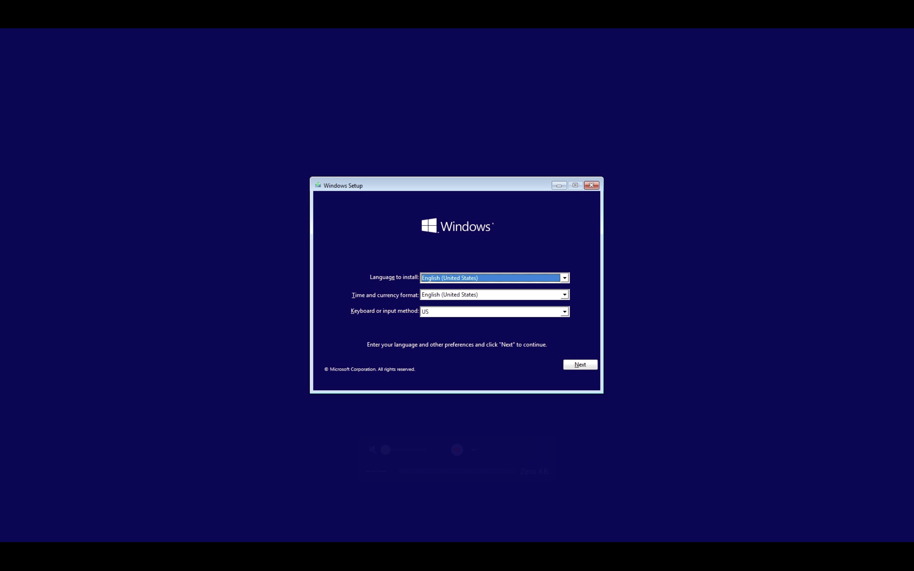

# woa-rk3576

[](https://github.com/gahingwoo/woa-rk3576/actions/workflows/ci.yml)
[](LICENSE)
[]()
[]()

Windows-on-ARM (WOA) kernel drivers for Rockchip **RK3576** boards — Radxa
ROCK 4D, ArmSoM CM5-IO and the other CM5 carriers.

Windows on ARM discovers hardware through **ACPI**, not Device Tree. The boot
firmware and ACPI tables live in the separate
[EDK2 RK3576 port](https://github.com/gahingwoo/edk2-rk3576); **this repo is
the Windows `.sys`/`.inf` driver packages** for the SoC peripherals Windows has
no inbox driver for, plus docs for the peripherals that *do* use inbox drivers.

## Where the drivers come from

The drivers are ported from
[worproject/Rockchip-Windows-Drivers](https://github.com/worproject/Rockchip-Windows-Drivers),
the RK3588 set that runs on real silicon. Every one of them binds the same
ACPI `_HID` the RK3576 firmware publishes for the same IP block. They were
imported unmodified at `e00e70d`, and each RK3576 change is a separate commit
on top, so `git log -- drivers/<class>/<name>` shows exactly what differs from
RK3588 and why. Provenance and licences per driver:
[THIRD_PARTY.md](THIRD_PARTY.md).

The drivers this repo had before were written from scratch. They were
replaced on 2026-10-01; they are in git history.

## Status

| Peripheral | `_HID` | Driver | RK3576 changes | State |
|---|---|---|---|---|
| eMMC | `RKCP0D40` | [dwcsdhc](drivers/sd/dwcsdhc) (sdport) | card clock from the CRU instead of a BL31 SiP call; vendor bits restored after reset | builds · not yet run on RK3576 |
| SD card | `RKCPFE2C` | [dwcmshc](drivers/sd/dwcmshc) (sdport) | clock from the CRU, phases in the controller's `TIMING_CON`, 3.3 V only | builds · not yet run on RK3576 |
| GPIO | `RKCP3002` | [rk3xgpio](drivers/gpio/rk3xgpio) (GpioClx) | accepts GPIO version `V2_2` | builds · not yet run on RK3576¹ |
| I²C | `RKCP3001` | [rk3xi2c](drivers/i2c/rk3xi2c) (SpbCx) | none; needs `rockchip,bclk` from the firmware² | builds · not yet run on RK3576 |
| DMA | `ARMH0330` | [pl330dma](drivers/dma/pl330dma) | none | builds · not yet run on RK3576 |
| Ethernet GMAC0 | `RKCP6543` | [dwc_eqos](drivers/net/dwc_eqos) (NetAdapterCx) | none | builds · not yet run on RK3576³ |
| SPI | `RKCP3003` | [rk3xspi](drivers/spi/rk3xspi) (SpbCx) | ours; RK3588 has no SPI driver | builds · not run on silicon |
| NVMe | — (PCIe) | **inbox** stornvme | | **Working** in a stock ADK WinPE |
| USB (xHCI) | `PNP0D10` | **inbox** usbxhci | | working for input; `XHC0` (the USB-C DWC3) is code 10 |
| Display | — | **inbox** BasicDisplay | | UEFI GOP framebuffer ([display](docs/DISPLAY.md)) |
| Audio | — | not ported | | RK3576 uses SAI, not RK3588's I²S-TDM ([audio](docs/AUDIO.md)) |

¹ The driver it replaced, written for this repo, had started on hardware on four
  of the five banks. If `rk3xgpio` does worse, that one commit is the thing to
  revert.
² The firmware did not publish it, and `rk3xi2c` refuses to start without it.
  Added on the firmware's `woa-drivers` branch.
³ `dwc_eqos` reads link state from the MAC's RGMII in-band status and never
  touches MDIO. Whether CM5-IO's Motorcomm YT8531C sends in-band status the way
  RK3588 boards' PHYs do is not known yet.

"Builds" means zero errors in CI against the WDK on every push. None of the
ported drivers has run on RK3576 hardware yet.

GPIO, I²C, SPI and GMAC sit on class extensions (GpioClx, SpbCx, NetAdapterCx);
the two storage drivers need only sdport, which WinPE carries.

### What the board had shown before the port

WinPE boots and runs. All 8 CPUs come up at 1608 MHz, and the NVMe works on the
inbox driver. The from-scratch eMMC driver ran identification through EXT_CSD
and stopped at the bus-width test; the SD driver never issued a command.

**An SD card in the slot used to make Windows crawl or bugcheck**, because no
UEFI driver quiesced the SD controller at ExitBootServices. Fixed in the
firmware; four clean card-present boots since, which is not yet a number to
trust. Record whether a card is in the slot on every run.



## Build

These are **ARM64 kernel drivers**. The ported set builds as one solution, the
way worproject's own CI builds it:

```cmd
msbuild build\RockchipDrivers.sln /p:Configuration=Release /p:Platform=ARM64
```

Packages land in `build\ARM64\Release\Output\<driver>\`. SPI builds on its own:

```cmd
msbuild drivers\spi\rk3xspi\rk3xspi.vcxproj /p:Configuration=Release /p:Platform=ARM64
```

CI builds both on every push and fails on any error
([ci.yml](.github/workflows/ci.yml)). The WinPE image workflow
([winpe.yml](.github/workflows/winpe.yml)) injects eMMC, SD, GPIO, I²C, DMA,
GMAC and SPI, test-signed. It leaves the audio drivers out: there is no RK3576
audio device in the DSDT, and `rk3xi2sbus` binds `RKCP3003`, which is our SPI.

Toolchain, test-signing and install: [docs/BUILDING.md](docs/BUILDING.md).

## Firmware (ACPI) changes

The RK3576 EDK2 port is part of this project; the ACPI changes the drivers
depend on are made there.

In the firmware's `main`:

- ACPI built into the image, with `PcdConfigTableModeDefault = 0x3` so one
  image serves both FDT (Linux) and ACPI (Windows).
- The RK3588 SCMI device removed: it rang a doorbell RK3576 does not have, and
  it is what made Setup bugcheck.
- The MCFG and MADT fixes that got NVMe working and all eight CPUs up.
- The eMMC `_DSD` and `_DSM` corrected for RK3576.
- Both SD/eMMC controllers quiesced at ExitBootServices.

On the firmware's `woa-drivers` branch, for the ported drivers:

- `rockchip,bclk` on every I²C controller.
- The SD UHS modes off and `no-1-8-v` set: nothing Windows can reach switches
  the card's signalling to 1.8 V on RK3576.

Still open:

- **Audio.** RK3576 has SAI blocks, not RK3588's I²S-TDM, so `rk3xi2sbus`
  does not apply. The stale `I2s.asl` also reuses `RKCP3003`, our SPI's HID.
  See [docs/AUDIO.md](docs/AUDIO.md).

## Layout

```
build/                  RockchipDrivers.sln, common.props (from worproject)
drivers/
  sd/dwcsdhc/           eMMC host (DWCMSHC)        sdport miniport
  sd/dwcmshc/           SD card host (dw_mmc)      sdport miniport
  gpio/rk3xgpio/        GPIO controller            GpioClx
  i2c/rk3xi2c/          I²C controller             SpbCx
  dma/pl330dma/         PL330 DMA controller
  net/dwc_eqos/         GMAC Ethernet (DWC EQoS)   NetAdapterCx
  spi/rk3xspi/          SPI controller             SpbCx (ours)
  audio/                I²S, codec, audio port (RK3588 only, not injected)
  lib/, shared/, include/, sd/rk_sip_sdmmc_lib/   shared code
  inc/                  RK3576 SoC constants (ours)
docs/                   bring-up plan, install, storage, display, audio
tools/
  make-woa-usb.sh       build a Windows install stick that boots without NVRAM
  woa-debug/            collect.cmd: what to run inside WinPE, and why
.github/workflows/      CI and the WinPE image
```

## Acknowledgements

Thanks to **[ArmSoM](https://www.armsom.org/)** for sponsoring the **CM5** module
and the **CM5-IO** carrier board this project is developed on.

The drivers are the work of the
[worproject Rockchip-Windows-Drivers](https://github.com/worproject/Rockchip-Windows-Drivers)
authors: Mario Bălănică (SD/eMMC), CoolStar (GPIO, I²C, DMA, audio) and
Doug Cook (Ethernet), building on Microsoft's driver samples.

## License

Code written for this repository is MIT — see [LICENSE](LICENSE). The ported
drivers keep their own licences (MIT, Apache-2.0, BSD); see
[THIRD_PARTY.md](THIRD_PARTY.md).
